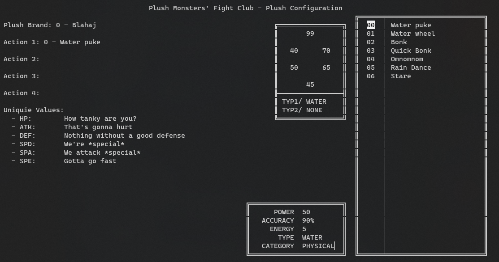

# Plush Monsters' Fight Club   USER'S DOCUMENTATION

## Table of contents
<!-- @import "[TOC]" {cmd="toc" depthFrom=2 depthTo=3 orderedList=false} -->

<!-- code_chunk_output -->

- [Table of contents](#table-of-contents)
- [Starting the game](#starting-the-game)
  - [Game Mode](#game-mode)
  - [Number of plushes](#number-of-plushes)
  - [AI or LAN play](#ai-or-lan-play)
  - [Plush creation menu](#plush-creation-menu)
- [Main game](#main-game)
  - [Attack](#attack)
  - [Swap](#swap)
  - [Forfeit](#forfeit)

<!-- /code_chunk_output -->

## Starting the game
When starting the game you get to select a few settings you want to use for the
game ("how will you fight today?" prompt)

When selecting options, you only need to click the first letter of the option.

### Game Mode
|                      | Random | Custom | Detailed |
|----------------------|--------|--------|----------|
| Custom brand         |   X    |   ✓    |    ✓    |
| Custom actions       |   X    |   ✓    |    ✓    |
| Custom UVs           |   X    |   X    |    ✓    |
| Custom Overlord type |   X    |   X    |    ✓    |

### Number of plushes
You can select the number of plushes you want to play with (1-3).

In Custom or Detailed mode, you'll have to go through the plush config screen
once for every plush.

### AI or LAN play
You can choose between playing against an AI (Overlord) or a human opponent
though LAN multiplayer.

#### AI/Overlord
If playing in detailed mode, you can choose between these types of Overlords:
* Dennis: Picks moves randomly
* Clyde: Waits 5-10 seconds before selecting a move randomly
* Ninty: Will always use the move that deals the most damage, always has high
  stat plush with high UVs (50-63)
* Waffles: Will always use the move that deals the least damage, but always has
  high stat plush with medium-high UVs (40-50)
* Muffins: Will always use the move that deals the least damage

On random and custom modes, the overlord will be chosen randomly.

#### LAN
If playing in LAN mode, you can choose to act as the server or client.

From a gameplay perspective, there is almost no difference in the two modes,
but for communication it is important to define the server and client.

Configuring the connection is similar for on both server and client side, and 
only a single IP address is required:
* For the server, this means the computer's IP that is to be used for communication. 
* For the client, this IP is the server's IP

### Plush creation menu

The plush create menu can be divided into five segments:
* Input/prompt fields (top left)
* UV input (bottom left)
* Plush Base stat hexagon (top middle)
* Action information table (bottom middle)
* Selector menu (right bar)

When opening the configurator, you need to "answer" the questions from the
prompt fields one by one by selecting the options from the selector menu.
Selections can be made by the arrow keys and enter or space can be used to
confirm a selection.

#### Brand
During brand selection, the highlighted brand will show all information about
the brand in and bellow the base stat hexagon, where the base stat of the brand
is shown in standard stat order clockwise from the top. This information will
stay on screen for future reference as well.

> Standard Stat order: HP - Attack - Defense - Speed - Special Attack - 
Special Defense

#### Actions
During action selection, the highlighted actions stats will be shown in the
action information table.

#### UVs
UVs can only be set when in detailed mode, in custom mode this section is 
skipped. 

When all previous questions are answered, you can enter the UVs for the plush.
These values are entered manually, using numbers. They can range from 0 to 63

## Main game
During gameplay you can see both your (bottom) and your opponent's (top) health
bar and your exact health. To make a choice, you can use the same arrow-enter
selection system and the menu in the bottom right.

### Attack
You can choose to attack and select one of the four actions your plush has.
Relevant information about the actions will be shown bellow the menu.

### Swap
If you are playing with multiple plushies, you can choose to swap into another
one using the swap option. This will let you choose a different plush.

### Forfeit
If you wish to end the game you can choose to forfeit (give up) - this will
make you loose.