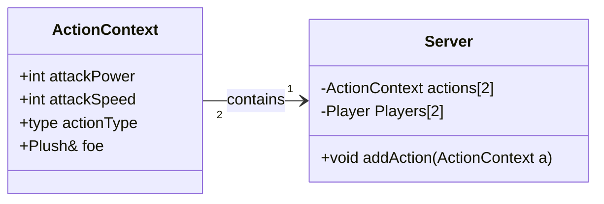
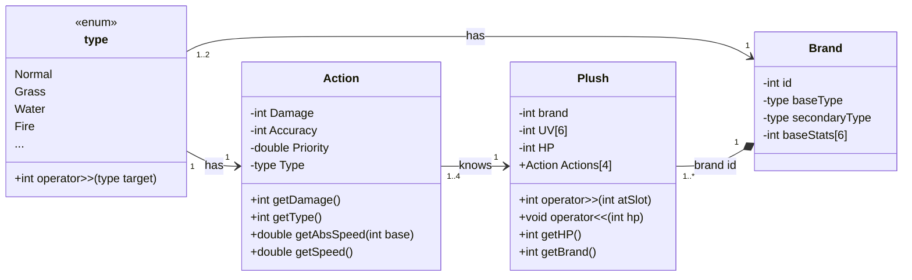
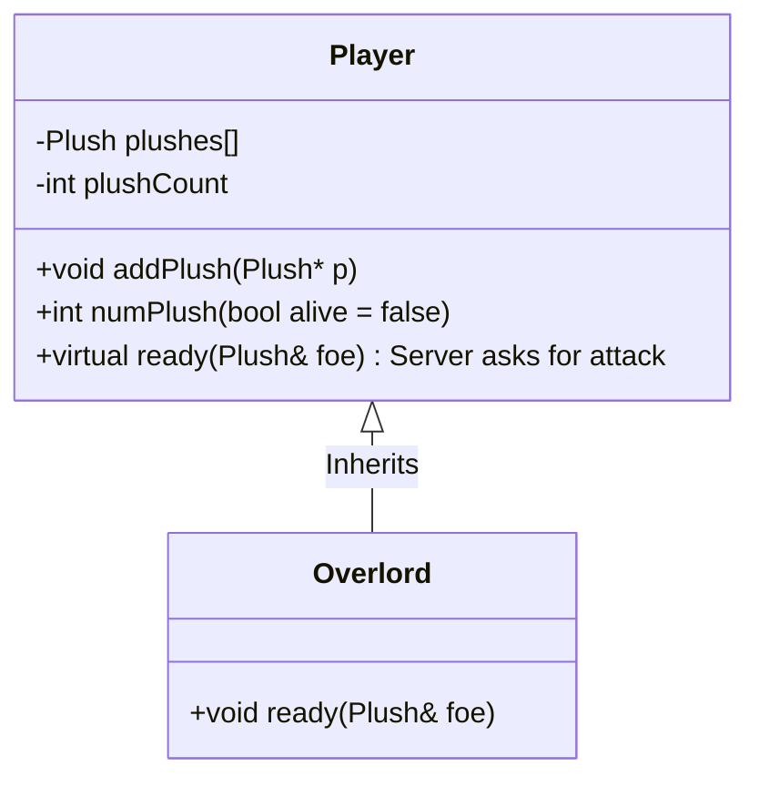
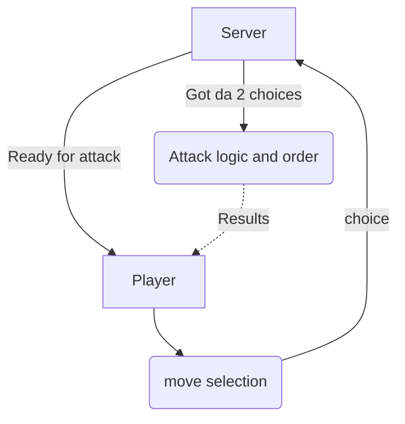

# Plush Monsters' fight club   PROGRAM PLAN

> **Disclaimer:**
The following diagrams only show the most important parts of the application
and may not contain every implemented function or the exact way they were 
implemented. This is only a high-level overview and not an exact description.

## Attacks
When attacking, both players choose their attack and send it to the Server
which distributes the attacks

## Plush classes

## Player classes
The overlord (AI player) classes inherit the player class and overrides the
ready function with their attack logic. 

## Flowchart
goes brrr

