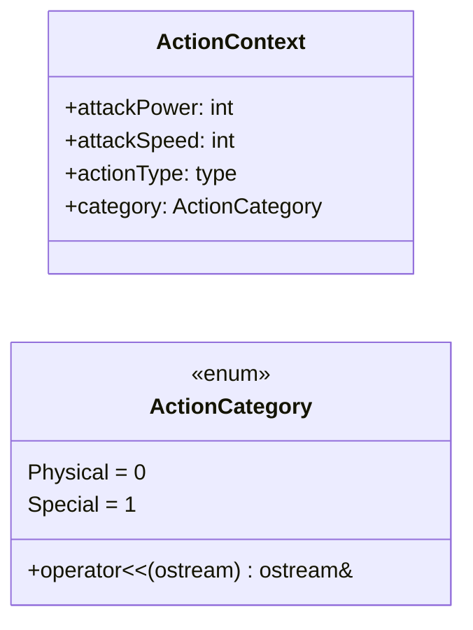
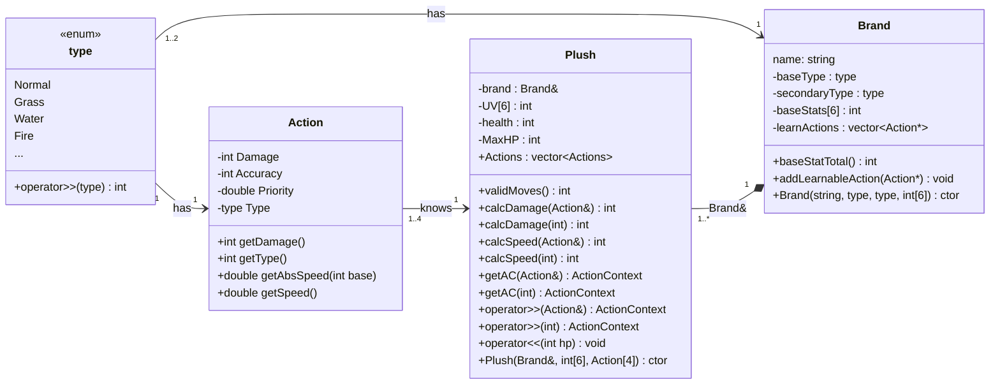
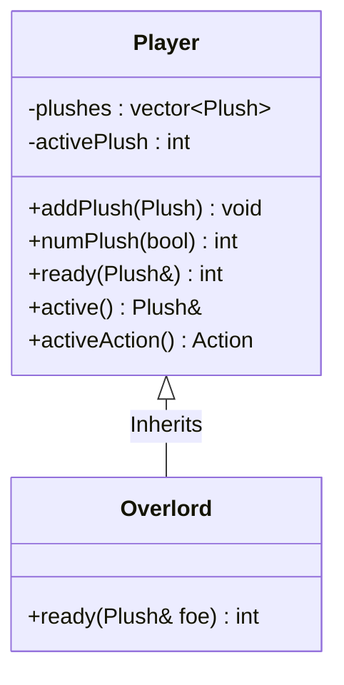
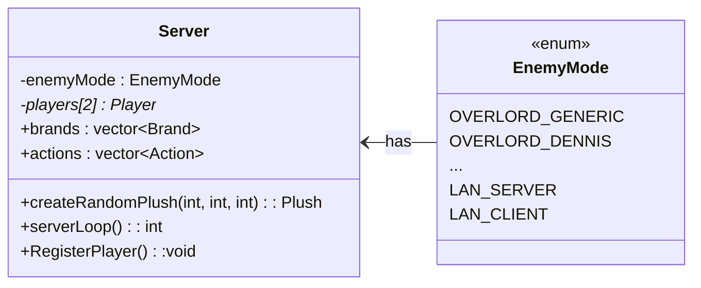

# Plush Monsters' Fight Club   PROGRAM PLAN

> **Disclaimer:**
The following diagrams only show the most important parts of the application
and may not contain every implemented function or the exact way they were 
implemented. This is only a high-level overview and not an exact description.

## Table of contents {ignore=true}
<!-- @import "[TOC]" {cmd="toc" depthFrom=2 depthTo=3 orderedList=false} -->

<!-- code_chunk_output -->

- [Action data structures](#action-data-structures)
- [Plush classes](#plush-classes)
  - [Plush operators](#plush-operators)
- [Player classes](#player-classes)
- [Server](#server)
- [Gameplay loop](#gameplay-loop)

<!-- /code_chunk_output -->

## Action data structures
When attacking, both players choose their attack and send it to the server.
The server takes their selection and creates an Action context if an attack
was selected. This ActionContext is used to attack or get attacked.

## Plush classes
Note: Getter functions are not listed for readability

### Plush operators 
- `operator>>(Action&) : int` - Get damage of executed action
- `operator<<(int) : void` - Apply exact amount of damage to Plush
- `operator<<(ActionContext) : void` - Apply damage based on context
- `operator>>(ActionContext&, Plush&) : int` - Get exact amount of damage by an
ActionContext on a specific Plush

## Player classes
The overlord (AI player) classes inherit the player class and overrides the
ready function with their attack logic. Note: For readability, only a single
overlord class is illustrated, while each overlord type has its own class.

## Server
The server class the one containing almost everything else - the players, the
available plushes and actions in the current game, and it is responsible for
the main gameplay loop.

The constructor loads all Plush data and Action data from the data files.

If LAN mode is selected, the server will handle all communication with the
other server through a library/submodule and use a "dummy player" as the
second player. This dummy player works the same way a regular would, except it
is only told the changes and can not act on its own.

## Gameplay loop
At the start of the next gameplay loop, the server asks the two players 
asynchronously to select their Action for their turn. Once both players
responded, the server handles action priority (forfeir > swap > attack) and
distributes the attacks. 

Once all actions have been handled, the server checks if the players' plushies
are still alive, and swaps them out to the next alive one if not. If none of 
the player's plushies are alive anymore, the other player is declared winner.
